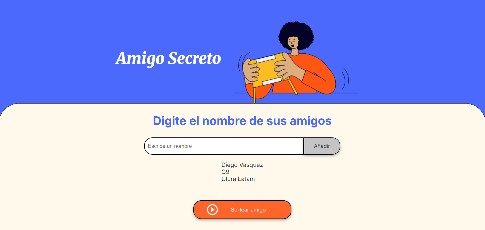
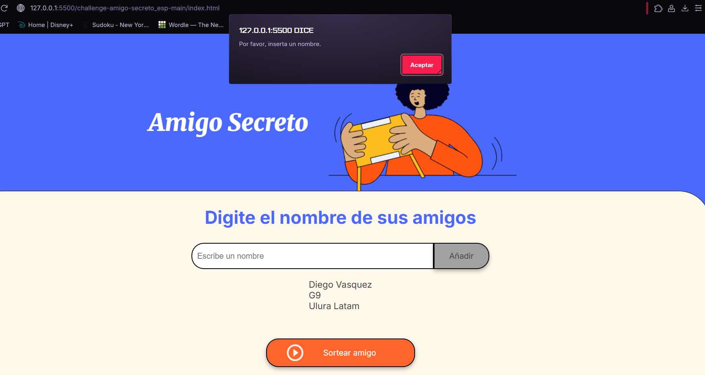
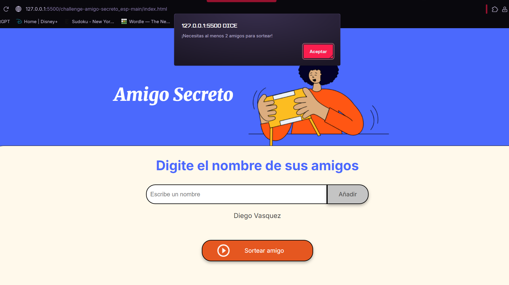
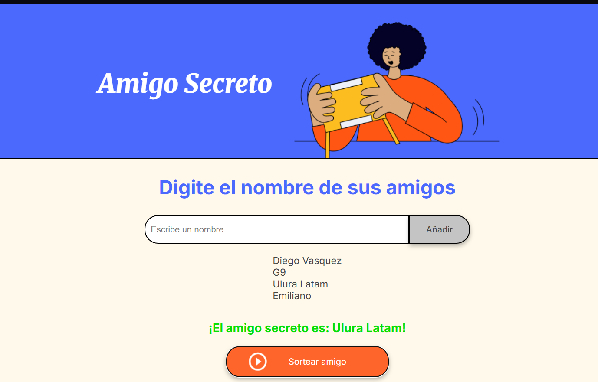
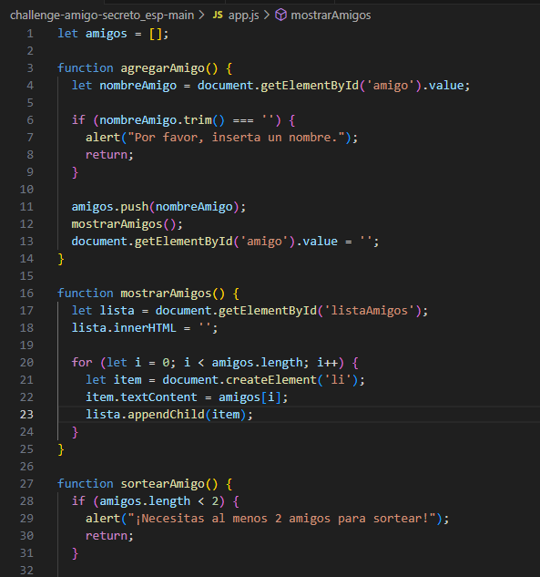
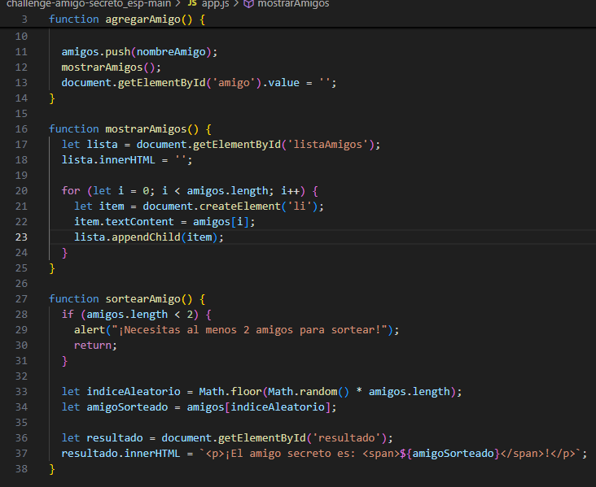
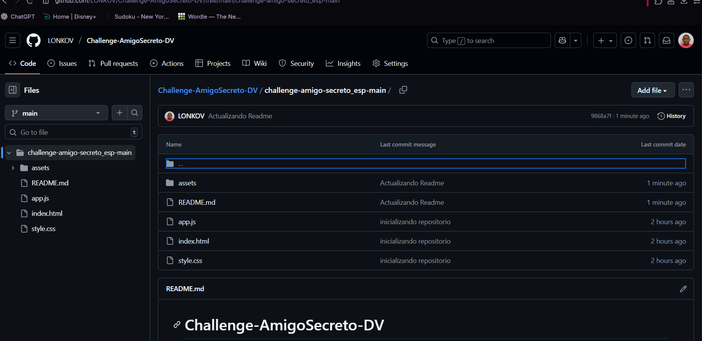
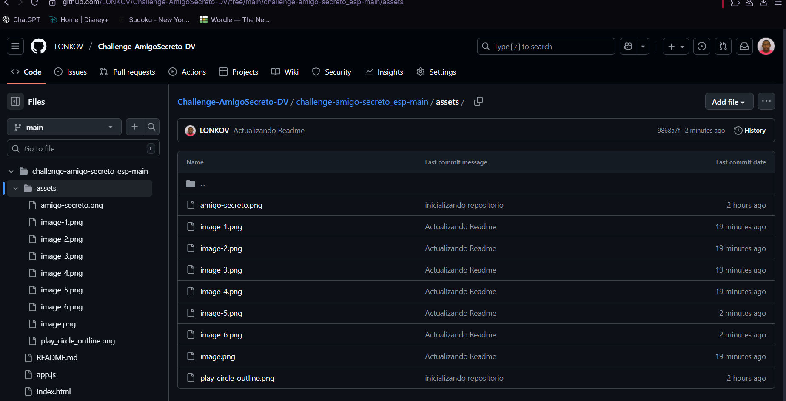

# Challenge-AmigoSecreto-DV

Desafío de Amigo Secreto
¡Hola y bienvenido a mi solución para el desafío del Amigo Secreto! Este proyecto fue un ejercicio práctico para combinar HTML, CSS y JavaScript para crear una aplicación web simple pero interactiva.

Me gustó porque pude aplicar conceptos básicos de programación, como la lógica de las funciones, las validaciones de datos y la manipulación del DOM para lograr una interacción real con el usuario. Fue un excelente punto de partida para ver cómo una página estática se puede transformar en una aplicación dinámica y útil.

¿Cómo funciona?
Características principales
Agregar participantes fácilmente: Escribe un nombre y haz clic en el botón para añadirlo a la lista.

Validaciones inteligentes: La aplicación te avisa si el campo de texto está vacío o si no hay suficientes participantes para el sorteo.

Sorteo automático y justo: Una vez que tengas al menos dos participantes, el sistema elige un amigo secreto de manera aleatoria.

Ademas se comparte evidencia de codigo Desarrollado:

y el Github: 
